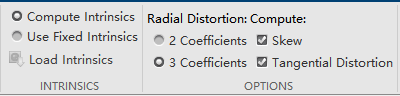

### Description
用于完整实现标定到生成相机参数配置文件全过程。
### Usage
- step1
  使用mindvision演示程序采集标定图片，设置图片大小为1280x2560，保存在Pictures文件夹；
- step2
运行脚本`split_pictures.py`，完成图片切割；
- step3
使用MATLAB相机标定工具箱（Stereo Camera Calibrator，棋盘格大小为35mm）；如图设置：

- step4
在工作区导出stereoParams.mat，运行`processStereoParams.m`，得到CameraParams.mat；
- step5
运行脚本`writeYaml.py`，生成新的相机配置文件`camera_paras.yaml`
### Bug
生成的相机配置文件保留小数点位数过多，导致空间点求解时出现'nan'情况；
