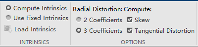

## The Whole Process of Stereo Camera Calibration 
### Quick Start
- step1: 使用mindvision演示程序采集标定图片，设置图片大小(建议为1280x2560），保存在Pictures文件夹；
- step2: 运行脚本`split_pictures.py`，完成图片切割；
- step3: 使用MATLAB相机标定工具箱（Stereo Camera Calibrator，棋盘格大小为35mm）；如图设置：

- step4: 标定完成后，在工作区导出stereoParams，运行`processStereoParams.m`，得到CameraParams.mat；
- step5: 运行脚本`writeYaml.py`，生成新的相机配置文件`camera_paras.yaml`

### File Description
| File name | &description;
| :--- | :----------
| MindVisionCameraCalibration
| &boxvr;&nbsp; ReadMe.md | 
| &boxvr;&nbsp; Output | 
| &boxv;&nbsp; &boxvr;&nbsp;  calibrationSession.mat | (若存在) 相机标定会话，包含标定过程的所有相机参数
| &boxv;&nbsp; &boxvr;&nbsp;  camera_paras.yaml | 生成的相机参数配置文件
| &boxv;&nbsp; &boxur;&nbsp;  CameraParams.mat | `processStereoParams.m`默认输出结果
| &boxvr;&nbsp; Script | 
| &boxv;&nbsp; &boxvr;&nbsp;  file_input_output.py | File Input and Output using XML and YAML files
| &boxv;&nbsp; &boxvr;&nbsp;  processStereoParams.m | 处理导出到MATLAB工作区的stereoParams并输出；
| &boxv;&nbsp; &boxvr;&nbsp;  split_picture.py | 分割双目图像
| &boxv;&nbsp; &boxur;&nbsp;  writeYaml.py | 写入配置文件
| &boxvr;&nbsp; Src | 
| &boxv;&nbsp; &boxvr;&nbsp;  L | 默认分割后左相机保存位置
| &boxv;&nbsp; &boxvr;&nbsp;  R | 默认分割后右相机保存位置
| &boxv;&nbsp; &boxvr;&nbsp;  Picture | 默认采集到的图片读取位置
| &boxr;&nbsp; &boxur;&nbsp;  writeYaml.py | 写入配置文件
